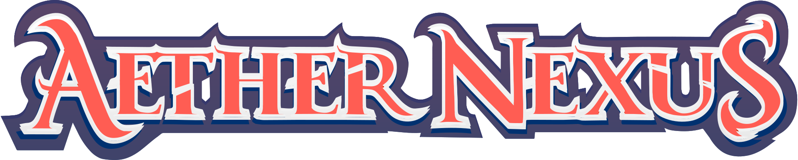

 

The **official** system for Aether Nexus, from [Absolute Tabletop](https://absolutetabletop.com/).

Developed by [Cussa Mitre | Hod Publishing](https://hodpub.com).

> [!WARNING]
> ## 🚧 System Under Development
> 
> **Important Notice:** This system is currently in active development. Consider the current releases as "beta", which implies that breaking changes may occur. While we strive to minimize disruptions, they are sometimes unavoidable.
> 
> Please, use the system with this in mind, understanding that changes are ongoing. Your patience and feedback are greatly appreciated as we work towards refining and stabilizing the system.

# Quick guide for the System
- Go to items and create the kin
- Go to items and create the frame
- Go to items and create the boon
- Go to items and create the augment
- Go to items and create the weapon/shield
- Go to actor and create a character
  - Drag and drop the items above to the character sheet
